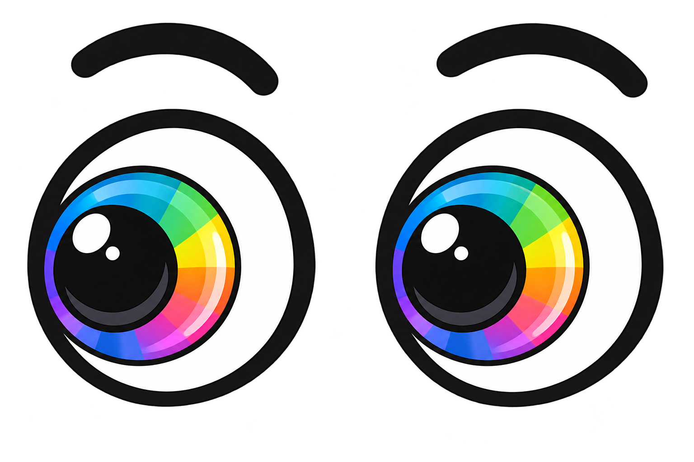

# EyeX



EyeX es una API sencilla para activar un **modo daltónico por tema** en una página web, aplicación o panel. En lugar de transformar colores uno por uno, EyeX devuelve una paleta completa para toda la pantalla.

La idea es simple: el usuario elige un modo de visión, la aplicación consulta EyeX una vez y recibe siete colores coordinados para fondo, superficies, texto, acciones y estados.

## Modos disponibles

EyeX ofrece cinco temas:

- `normal`
- `protanopia`
- `deuteranopia`
- `tritanopia`
- `achromatopsia`

EyeX no diagnostica daltonismo y no reemplaza una evaluación profesional de accesibilidad. La aplicación debe permitir que la persona elija el modo que prefiera.

## Probar EyeX con Docker Desktop

El contenedor principal utiliza la implementación en Go y también sirve la página web incluida en el proyecto.

Desde la carpeta raíz:

```bash
docker build -t eyex:local .
docker run --rm --name eyex -p 8080:8080 eyex:local
```

Después abre:

```text
http://localhost:8080
```

La página permite cambiar entre los cinco modos y aplica en tiempo real la paleta devuelta por la API.

Para detener el contenedor, usa `Ctrl + C` en la terminal donde se está ejecutando.

## Contrato de la API

### Obtener un tema

```http
GET /api/v1/theme/{type}
```

`{type}` debe ser uno de los cinco modos soportados.

Ejemplo:

```http
GET /api/v1/theme/deuteranopia
```

Respuesta `200 OK`:

```json
{
  "type": "deuteranopia",
  "palette": {
    "background": "#1E1E1E",
    "surface": "#2A2A2A",
    "text": "#F5F5F5",
    "primary": "#4A90D9",
    "secondary": "#D9A24A",
    "error": "#D94A4A",
    "success": "#4AD98C"
  }
}
```

Si el tipo no existe, EyeX responde `400 Bad Request`:

```json
{
  "error": "invalid_type",
  "message": "Tipo de daltonismo no soportado"
}
```

### Consultar los modos disponibles

```http
GET /api/v1/theme/types
```

Respuesta `200 OK`:

```json
{
  "types": ["normal", "protanopia", "deuteranopia", "tritanopia", "achromatopsia"]
}
```

## Cómo se usa en una interfaz

Una integración normal tiene cuatro pasos:

1. Preguntar qué modo desea utilizar la persona.
2. Guardar esa preferencia en el perfil o en `localStorage`.
3. Consultar `GET /api/v1/theme/{type}` una vez cuando carga el tema.
4. Aplicar los siete valores recibidos como variables CSS globales.

Ejemplo en JavaScript:

```javascript
const response = await fetch('/api/v1/theme/deuteranopia');
const data = await response.json();

for (const [name, value] of Object.entries(data.palette)) {
  document.documentElement.style.setProperty(`--eyex-${name}`, value);
}
```

Después, los componentes utilizan esas variables:

```css
body {
  background: var(--eyex-background);
  color: var(--eyex-text);
}

.card {
  background: var(--eyex-surface);
}

.button-primary {
  background: var(--eyex-primary);
}
```

Así se cambia el tema completo sin hacer una llamada por cada botón, tarjeta o sección.

## Paletas incluidas

| Modo | Background | Surface | Text | Primary | Secondary | Error | Success |
| --- | --- | --- | --- | --- | --- | --- | --- |
| normal | `#F4F5F7` | `#FFFFFF` | `#20252B` | `#2E6DA4` | `#6B7785` | `#C94C4C` | `#3C8D5A` |
| protanopia | `#1E1E1E` | `#2A2A2A` | `#F5F5F5` | `#3F8FD2` | `#E3B341` | `#D96C3F` | `#4FB3A5` |
| deuteranopia | `#1E1E1E` | `#2A2A2A` | `#F5F5F5` | `#4A90D9` | `#D9A24A` | `#D94A4A` | `#4AD98C` |
| tritanopia | `#202124` | `#2D2F33` | `#F5F5F5` | `#D65DB1` | `#4CC9A7` | `#E05A47` | `#64A66F` |
| achromatopsia | `#202020` | `#303030` | `#F2F2F2` | `#D0D0D0` | `#A8A8A8` | `#E0E0E0` | `#BEBEBE` |

Estas paletas son los valores por defecto del producto. Mantenerlas idénticas en todas las implementaciones evita que una aplicación cambie de apariencia según el backend que utilice.

## Implementaciones incluidas

El repositorio contiene la misma API escrita de forma independiente en cuatro backends:

| Implementación | Ubicación | Tecnología |
| --- | --- | --- |
| Go | raíz del proyecto | `net/http` |
| PHP | `implementations/php` | PHP 8, rutas ligeras sin framework |
| TypeScript | `implementations/typescript-node` | Node.js + Fastify |
| Java | `implementations/java` | Java 21 + Spring Boot |

También incluye dos clientes:

| Cliente | Ubicación | Uso |
| --- | --- | --- |
| HTML + JavaScript | `frontend/html-js` | Página principal servida por el backend Go |
| Vue | `frontend/vue` | Ejemplo alternativo con Vue 3 y composable propio |

Todos los backends deben conservar exactamente los mismos dos endpoints, tipos, nombres de campos y paletas.

## Ejecutar la versión Go sin Docker

Requisitos: Go 1.23 o superior.

```bash
go test ./...
go run ./cmd/api
```

Abre `http://localhost:8080`.

## Ejecutar la versión PHP

Requisito: PHP 8.2 o superior.

```bash
cd implementations/php
php -S 127.0.0.1:8080 public/index.php
```

Prueba:

```bash
curl http://localhost:8080/api/v1/theme/protanopia
```

## Ejecutar la versión TypeScript (Node)

Requisitos: Node.js 20 o superior y npm.

```bash
cd implementations/typescript-node
npm install
npm run dev
```

Para compilar y ejecutar JavaScript generado:

```bash
npm run build
npm start
```

## Ejecutar la versión Java

Requisitos: Java 21 y Maven.

```bash
cd implementations/java
mvn spring-boot:run
```

## Ejecutar el cliente Vue

Primero deja uno de los backends escuchando en `http://localhost:8080`.

En otra terminal:

```bash
cd frontend/vue
npm install
npm run dev
```

Abre `http://localhost:5173`.

Durante desarrollo, el cliente Vue utiliza `http://localhost:8080` como API. Si necesitas otra dirección, puedes abrir la página agregando el parámetro `api`, por ejemplo:

```text
http://localhost:5173/?api=http://192.168.1.50:8080
```

No necesita un archivo `.env` propio.

## Configuración

El repositorio mantiene **un solo archivo `.env`**, ubicado en la raíz:

```dotenv
EYEX_PORT=8080
EYEX_ALLOWED_ORIGIN=*
```

No existen `.env.example`, `.env.local`, `.env.production` ni archivos similares.

`EYEX_PORT` define el puerto del servicio y `EYEX_ALLOWED_ORIGIN` permite controlar el origen autorizado para solicitudes desde navegador. En producción conviene reemplazar `*` por el dominio real del frontend.

El contenedor Docker no copia `.env` dentro de la imagen. Si quieres inyectarlo al ejecutar el contenedor:

```bash
docker run --rm --name eyex --env-file .env -p 8080:8080 eyex:local
```

## Estructura principal

```text
eyex/
├── cmd/api/                       # Arranque del backend Go
├── internal/                      # API, configuración, middleware y temas Go
├── implementations/
│   ├── php/                       # Backend PHP
│   ├── typescript-node/           # Backend Node + Fastify
│   └── java/                      # Backend Spring Boot
├── frontend/
│   ├── html-js/                   # Web principal sin framework
│   └── vue/                       # Cliente Vue 3
├── deploy/
│   ├── k8s/                       # Deployment, Service e Ingress
│   └── terraform/                 # Infraestructura GKE de referencia
├── .env                           # Único archivo de variables
├── Dockerfile
├── go.mod
└── README.md                      # Única documentación Markdown
```

## Despliegue

El `Dockerfile` compila el backend Go en una imagen multi-stage y copia la web HTML + JavaScript. Los manifiestos de Kubernetes están en `deploy/k8s` y el ejemplo de infraestructura GKE con Terraform está en `deploy/terraform`.

El flujo recomendado es:

```text
pruebas -> build -> imagen -> registry -> Kubernetes
```

## Alcance

EyeX está enfocado en cambiar la **paleta general de una pantalla**. No modifica imágenes, no analiza capturas, no detecta automáticamente el tipo de visión y no garantiza por sí solo el cumplimiento completo de WCAG. Para una aplicación real, el modo de color debe complementarse con etiquetas claras, estados comprensibles y una revisión general de accesibilidad.
